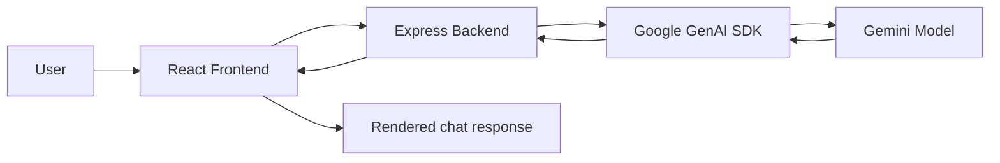

# ChatWithGPT

A lightweight chat application that connects a React frontend to a Node.js backend and sends user prompts to Google Gemini models.

## Overview

ChatWithGPT is a simple AI chat interface built for asking questions and receiving responses generated by Gemini models. The application is structured around a frontend-backend split:

- The React frontend renders the chat UI, handles user input, and displays responses with Markdown formatting.
- The Express backend accepts chat requests, selects a Gemini model, and forwards the prompt to the Google GenAI SDK.
- The backend calls the Gemini API with the selected model and returns the generated text to the frontend.

The request flow is straightforward:

User → React frontend → Express backend → Gemini API → backend response → frontend render

## Features

The implemented features confirmed in the repository include:

- Chat-style interface for sending and receiving text responses
- Model selection with multiple Gemini options
- Default model selection: `gemini-3.5-flash-lite`
- Loading indicator while a request is in progress
- Input validation to prevent empty submissions
- Auto-scroll behavior to keep the latest message visible
- Markdown rendering of AI responses using `react-markdown`
- Chat history persistence in browser `localStorage`
- Response error handling at both frontend and backend levels
- CORS protection with an explicit allowlist
- Health check endpoint for backend status monitoring
- Responsive layout for desktop and smaller screens

## Tech Stack

### Frontend

- React 19
- Vite
- JavaScript (ES modules)
- Tailwind CSS v4
- Ant Design `Spin` for loading UI
- `lucide-react` for send and status icons
- `react-markdown` for rendering AI responses
- ESLint for linting

### Backend

- Node.js
- Express 5
- dotenv
- CORS
- Google GenAI SDK (`@google/genai`)
- Nodemon

### AI / API

- Google Gemini models via the Google GenAI SDK
- Backend integration through `ai.models.generateContent()`

### Deployment / Hosting

The codebase contains deployment-related URLs and configuration patterns for:

- Frontend hosted on Vercel, as indicated by the allowed frontend origin in the backend CORS configuration
- Backend hosted on Azure App Service, as indicated by the deployed backend URL used by the frontend

The repository itself does not contain a full IaC or deployment configuration package, but the app is clearly written for separate frontend and backend hosting.

## Architecture



### Request/response flow

1. The user types a message in the React interface.
2. The frontend sends a POST request to the backend chat endpoint.
3. The backend reads the `question` and `model` fields from the request body.
4. The backend calls the Gemini SDK with the selected model and prompt.
5. Gemini returns generated text.
6. The backend sends the result back as JSON to the frontend.
7. The frontend updates the chat list and renders the response.

## Project Structure

```text
chatapp/
├── backend/
│   ├── .env
│   ├── .gitignore
│   ├── chat.js
│   ├── index.js
│   ├── package-lock.json
│   └── package.json
├── frontend/
│   ├── .gitignore
│   ├── eslint.config.js
│   ├── index.html
│   ├── package-lock.json
│   ├── package.json
│   ├── vite.config.js
│   ├── public/
│   ├── src/
│   ├── api.js
│   ├── App.css
│   ├── App.jsx
│   ├── index.css
│   ├── Loading.jsx
│   ├── main.jsx
│   └── assets/
└── README.md
```

### Important files

- `backend/index.js` — Express server setup, CORS rules, request handling, health endpoint, and server startup
- `backend/chat.js` — Gemini API integration using `@google/genai`
- `backend/package.json` — backend scripts and dependencies
- `frontend/src/App.jsx` — main chat UI, model selector, loading states, and chat logic
- `frontend/src/api.js` — frontend fetch wrapper for the backend API
- `frontend/src/Loading.jsx` — loading spinner component
- `frontend/vite.config.js` — Vite configuration with React and Tailwind
- `backend/.env` — local environment configuration for the backend API key and port

## How It Works

### Frontend communication

The frontend does not call Gemini directly. Instead, it sends requests to the backend using `fetch()` from `frontend/src/api.js`.

The current production backend URL is:

```js
https://chatwithgpt-backend-cshegwhtd9b4hbcb.centralindia-01.azurewebsites.net/api/chat
```

The request body includes:

```json
{
  "question": "Explain recursion in simple terms",
  "model": "gemini-3.5-flash-lite"
}
```

### Backend communication

The backend listens for `POST /api/chat` requests in `backend/index.js`.

It reads:

- `req.body.question`
- `req.body.model` with a fallback of `gemini-3.5-flash-lite`

Then it calls:

```js
const response = await main(question, selectedModel);
```

The `main()` function in `backend/chat.js` executes:

```js
await ai.models.generateContent({
  model: model,
  contents: question,
});
```

The generated text is returned to the client in a JSON object:

```json
{
  "message": "Generated response text here"
}
```

### Model selection

The frontend includes a `select` element with these implemented model IDs:

- `gemini-3.7-flash`
- `gemini-3.6-flash`
- `gemini-3.5-flash`
- `gemini-3.5-flash-lite`
- `gemini-3.1-flash-lite`

The default state is set to `gemini-3.5-flash-lite` in `frontend/src/App.jsx`.

## API Documentation

### Base URL

The frontend calls the deployed Azure backend directly. In local development, the backend runs on `http://localhost:5000` unless overridden by the `PORT` environment variable.

### Endpoints

| Method | Endpoint      | Purpose                                                  | Request Body                                | Response                                     |
| ------ | ------------- | -------------------------------------------------------- | ------------------------------------------- | -------------------------------------------- |
| POST   | `/api/chat`   | Send a prompt to Gemini and receive a generated response | `{"question": "string", "model": "string"}` | `{"message": "string"}`                      |
| GET    | `/api/health` | Check whether the backend is running                     | None                                        | Plain text: `Server is healthy and running!` |

### POST `/api/chat`

#### Example request

```bash
curl -X POST http://localhost:5000/api/chat \
  -H "Content-Type: application/json" \
  -d '{
    "question": "Write a short summary of modern web development.",
    "model": "gemini-3.5-flash-lite"
  }'
```

#### Example response

```json
{
  "message": "Modern web development typically includes HTML, CSS, JavaScript, responsive design, APIs, and frameworks such as React."
}
```

### GET `/api/health`

#### Example request

```bash
curl http://localhost:5000/api/health
```

#### Example response

```text
Server is healthy and running!
```

## Environment Variables

The project uses environment variables in the backend for runtime configuration.

| Variable         | Required | Used In                                                 | Example                    |
| ---------------- | -------- | ------------------------------------------------------- | -------------------------- |
| `GEMINI_API_KEY` | Yes      | `backend/chat.js` to initialize the Google GenAI client | `your_gemini_api_key_here` |
| `PORT`           | No       | `backend/index.js` to control the server port           | `5000`                     |

### Example backend `.env`

```env
GEMINI_API_KEY=your_gemini_api_key_here
PORT=5000
```

> The frontend does not store the Gemini API key. The key is kept on the backend side, where the Gemini SDK is initialized.

## Local Development Setup

### 1. Clone the project

```bash
git clone <repository-url>
cd chatapp
```

### 2. Backend setup

```bash
cd backend
npm install
```

Create a `.env` file inside the `backend` directory:

```env
GEMINI_API_KEY=your_gemini_api_key_here
PORT=5000
```

Start the backend:

```bash
npm start
```

The backend will run on the port from `PORT` or `5000` by default.

### 3. Frontend setup

```bash
cd ../frontend
npm install
```

Start the frontend development server:

```bash
npm run dev
```

Vite typically serves the app on:

```text
http://localhost:5173
```

### 4. Production frontend build

```bash
cd frontend
npm run build
```

You can preview the production build with:

```bash
npm run preview
```

## Deployment

The codebase is designed for a split deployment model:

- Frontend is intended to run as a Vite app on Vercel
- Backend runs as a Node.js/Express app on Azure App Service

This is supported by the actual project configuration:

- The frontend fetches a backend URL on Azure App Service
- The backend CORS allowlist includes a Vercel frontend origin

### Relevant deployment configuration from code

- Backend listens on `process.env.PORT || 5000`
- Frontend calls a production backend URL directly
- CORS only permits specific origins

### Production commands

Backend:

```bash
cd backend
npm start
```

Frontend:

```bash
cd frontend
npm run build
```

The repository does not include a deployment manifest such as `vercel.json`, Azure web app settings, or Docker configuration, so deployment is handled through the hosting platform configuration rather than repository files.

## CORS / Security

The backend configures CORS explicitly in `backend/index.js` using a whitelist of allowed origins:

- `https://chat-with-gpt-lyart.vercel.app`
- `http://localhost:5173`
- `http://localhost:3000`

The server accepts only `GET` and `POST` requests and only allows the `Content-Type` header. Requests from unapproved origins are rejected.

Security practices actually present in this codebase:

- API key is kept in the backend `.env` file
- The frontend does not directly initialize the Gemini SDK
- CORS restricts cross-origin access to approved clients

No authentication, user accounts, JWT layer, or rate-limiting middleware is implemented in the current repo.

## Error Handling

### Frontend

In `frontend/src/api.js`, the frontend wraps the request in a `try/catch` block.

If the request fails or the backend returns a non-OK response, it throws an error and returns a message like:

```text
Error fetching chat response: ...
```

The main app also filters persisted error messages from `localStorage` on startup and disables the send button when:

- the input is empty
- a request is already in progress

### Backend

In `backend/index.js`, the `/api/chat` route catches exceptions and responds with:

```json
{
  "message": "Error processing request, please try again later"
}
```

The server returns HTTP status `500` for request-processing failures.

## Screenshots

This repository does not currently include a screenshot directory or image assets for the app interface.

If screenshots are added later, they can be placed in a structure like:

```text
docs/
└── screenshots/
    ├── home.png
    └── chat.png
```

## Future Improvements

These are planned or potential improvements based on the current implementation, not current features:

- Add streaming responses for more natural chat UX
- Add conversation persistence on the backend with chat IDs and history storage
- Add user authentication and per-user chat sessions
- Add rate limiting and request throttling for production use
- Centralize the backend URL in a frontend environment variable instead of hardcoding the Azure URL
- Add model-specific system prompts and parameter tuning

## Resume / Portfolio Highlights

- Built a full-stack AI chat application using React on the frontend and Express on the backend.
- Integrated Google Gemini models with the official `@google/genai` SDK.
- Implemented a model-selection interface with multiple Gemini variants and a request pipeline for AI responses.
- Added frontend loading, validation, and error-handling states for a smoother user experience.
- Configured CORS and backend environment variables to keep the Gemini API key server-side.

## License

This repository does not currently declare a license. No license has been added in the project files reviewed here.
